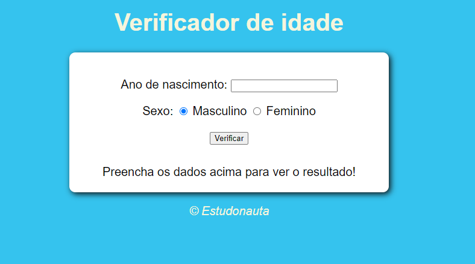
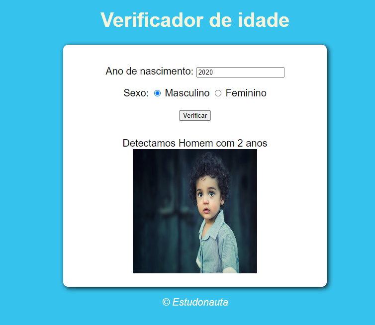
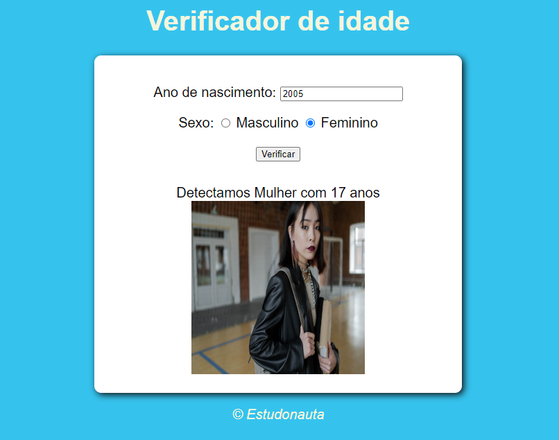
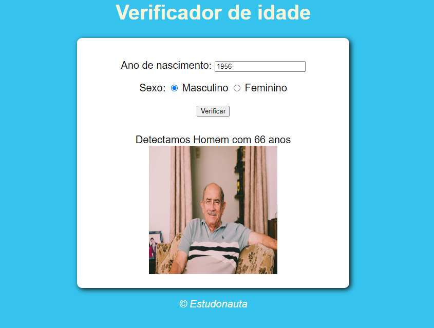

<h1 align="center"> Verificador de Idade </h1>

  <a href="#-tecnologias">Tecnologias</a>&nbsp;&nbsp;&nbsp;|&nbsp;&nbsp;&nbsp;
  <a href="#-projeto">Projeto</a>&nbsp;&nbsp;&nbsp;|&nbsp;&nbsp;&nbsp;
  <a href="#memo-licença">Licença</a>

  

 

  

<h2 align="center">
    Ao preencher o ano de nascimento e sexo, será exibido o cálculo da idade e uma imagem correspondendo o perfil detectado.
</h2>

  

  

  

  

## 🚀 Tecnologias

Esse projeto foi desenvolvido com as seguintes tecnologias:

- HTML e CSS
- JavaScript
- Git e Github

## 💻 Projeto

O Verificador de Idade é um projeto que após o preenchimento do ano de nascimento e sexo, o programa calcula a idade e exibe uma imagem correspondendo o perfil detectado. 

## :memo: Licença

Esse projeto está sob a licença MIT.

---

Feito com ♥ by Estudonauta.